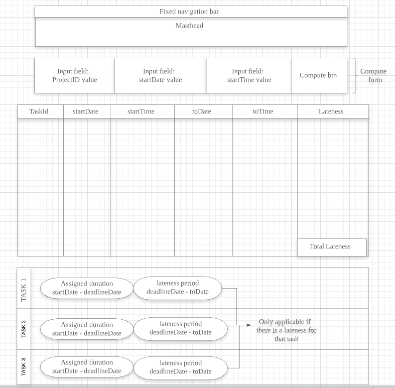
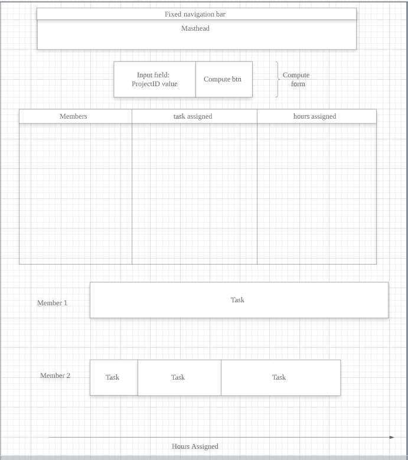

# Frontend

## Requirements

1. Basic/Advance Data viewer
    1. Pagination
        1. First page
        2. Next page
        3. Page size
    2. Filtering
        1. by 2 attributes
2. Basic Result viewer
    1. Input fields for 3 computation parameters
        - projectId
        - startDate
        - startTime
    2. Graphical view of duration taken to complete tasks
    3. Graphical view of lateness of tasks
3. Advance Result viewer
    1. Input fields for 1 computation paramter
        - projectId
    2. Graphical view of distribution of tasks by member

## Notes

-   Problem: Task Allocation
-   Libraries required:
    - Cypress

## How to run the codes

### Webpage (index.html)

1. cd frontend/files (workspaceFolder == fsp-jibaboom-2a11-team_name)
2. npx http-server -c-1

### Cypress automated tests (cypress_mock.js / cypress_acceptance.js)

1. cd frontend
2.  node_modules\.bin\cypress open, OR 
    node_modules\.bin\cypress run --spec "cypress/integration/{file_name}" ( To run headless, in cli )

###### Data Viewer

###### Result Viewer

Basic :

Advance :

