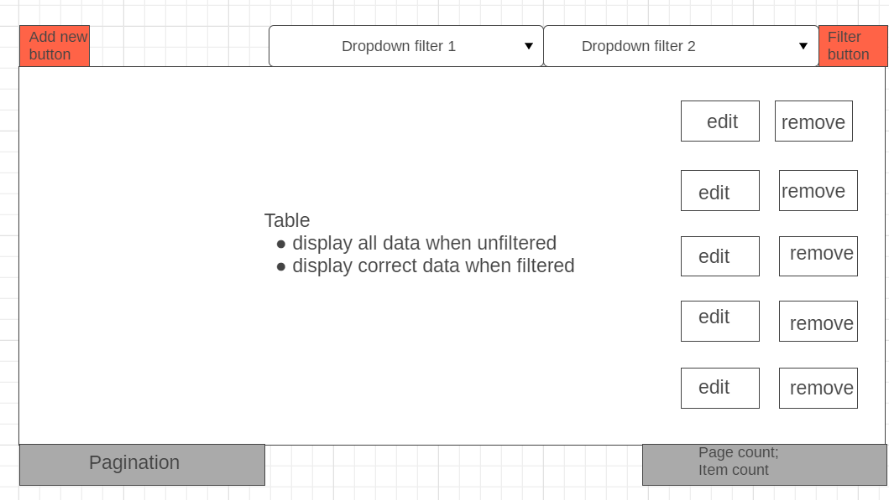
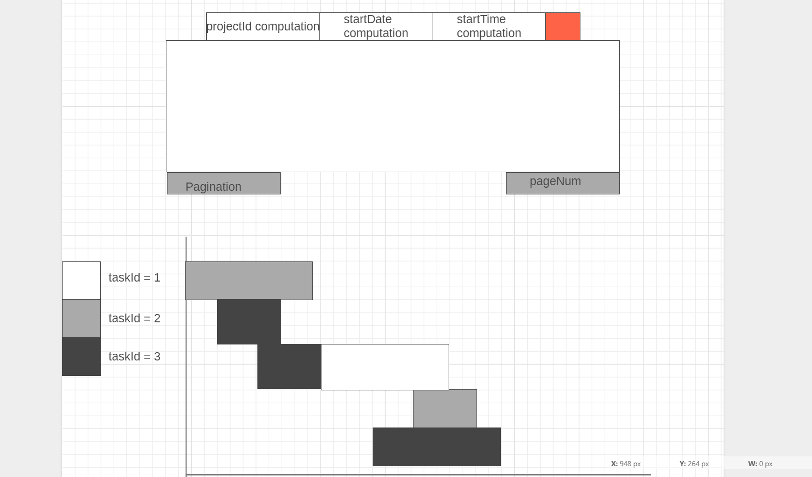

# Frontend

## Requirements

1. Basic/Advance Data viewer
    1. Pagination
        1. First page
        2. Next page
        3. Page size
    2. Filtering
        1. by 2 attributes
2. Basic/Advance Result viewer
    1. Input fields for 3 computation parameters

## Notes

-   Problem: Task Allocation

## How to run the codes

### Webpage (index.html)

1. cd frontend/files (workspaceFolder == fsp-jibaboom-2a11-team_name)
2. npx http-server -c-1

### Cypress (cypress_spec.js / cypress_mock.js)

1. cd frontend
2. node_modules\.bin\cypress open

###### Data Viewer

###### Result Viewer

