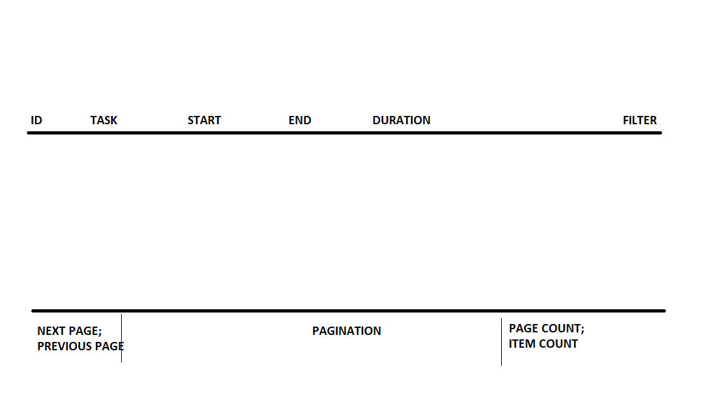
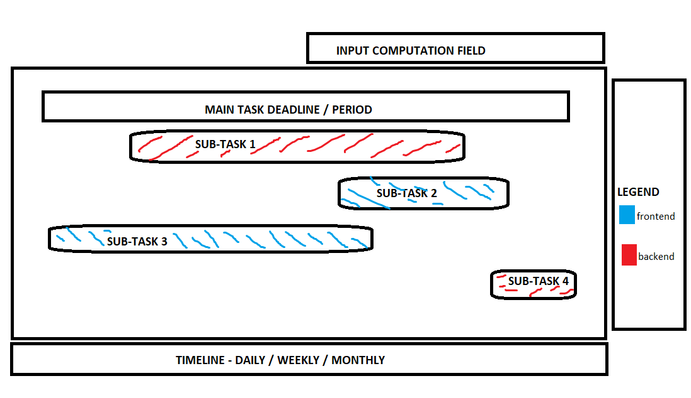

# Frontend

## Requirements

1. Basic/Advance Data viewer
    1. Pagination
        1. First page
        2. Next page
        3. Page size
    2. Filtering
        1. 2 input
2. Basic/Advance Result viewer
    1. Input fields for computation parameters

## Notes

-   Problem: Task Allocation

###### Data Viewer

###### Result Viewer

