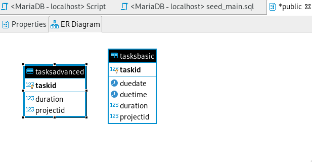

# Schema

For our database schema, we are using 2 tables:
- 1 tables for the basic problem
- 1 tables for the advanced problem

## Database creation and ERD

The statement used to create our database.
```sql
DROP TABLE IF EXISTS TASKSBASIC, TASKSADVANCED;

CREATE TABLE IF NOT EXISTS TASKSBASIC(
    taskId BIGINT UNIQUE NOT NULL,
    dueDate DATE NOT NULL,
    dueTime TIME NOT NULL,
    duration INT NOT NULL,
    projectId BIGINT NOT NULL,
    PRIMARY KEY (taskId)
);

CREATE TABLE IF NOT EXISTS TASKSADVANCED(
    taskId BIGINT UNIQUE NOT NULL,
    duration INT NOT NULL,
    projectId BIGINT NOT NULL,
    PRIMARY KEY (taskId)
);
```

The ERD of the database looks like this:  
