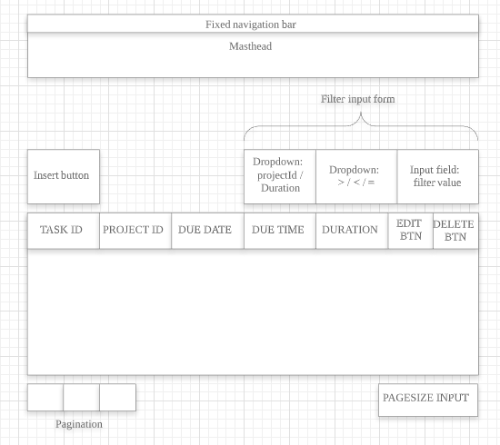
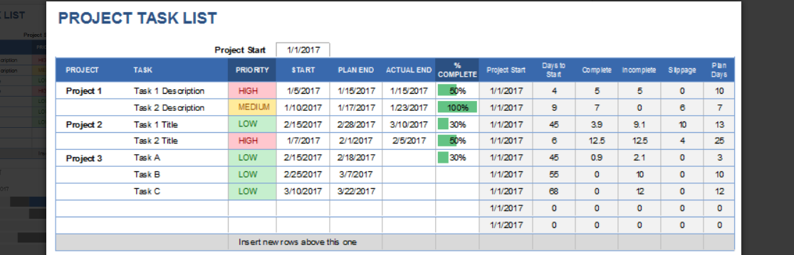
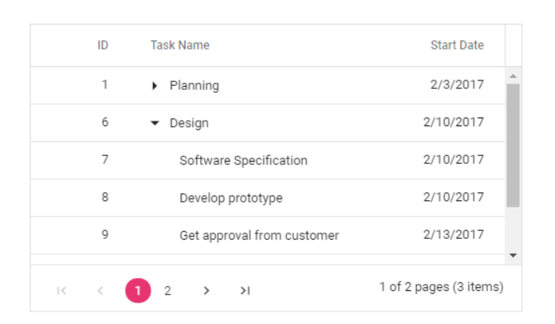
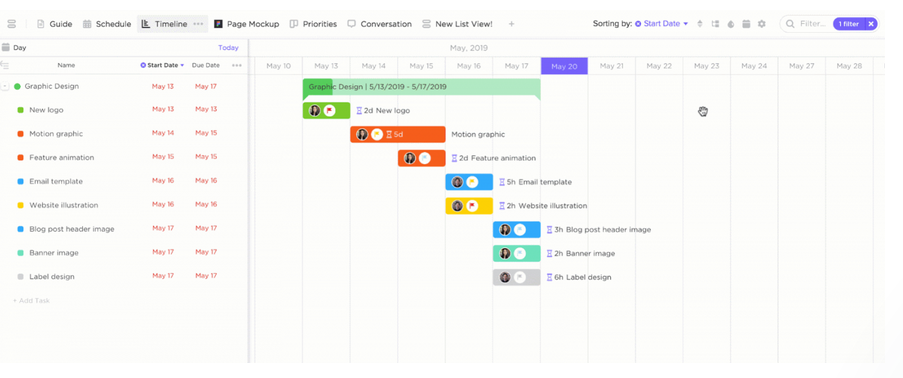

# Wireframe & Justification

## Wireframe

## Justifications

### Justification 1

#### Good Points

1. Layout itself is simple and clear, shows relevant information
2. Simple to implement - Tables

#### Bad Points

1. Does not have Pagination & Filtering fields
2. Some columns are irrelevant for the project scheme (i.e. 'Project')
3. Does not allow for sub-tasks

### Justification 2

#### Good Points

1. Pagination is simple and adheres to project requirements
2. Shows sub-tasks in a drop-down within the table
3. Simple layout

#### Bad Points

1. Only 3 columns
2. Does not have filtering fields

### Justification 3

#### Good Points

1. Input field available at the bottom to add a new task
2. Tasks can be color-coded which helps visualisation
3. Shows sub-tasks in a drop-down within the table

#### Bad Points

1. Filtering field (Upper right) has many icon options and is clean but seems to only change the Result Viewer portion. Still a good implementation idea for the Data Viewer however
2. No Pagination - Tasks are browsed using scrolling