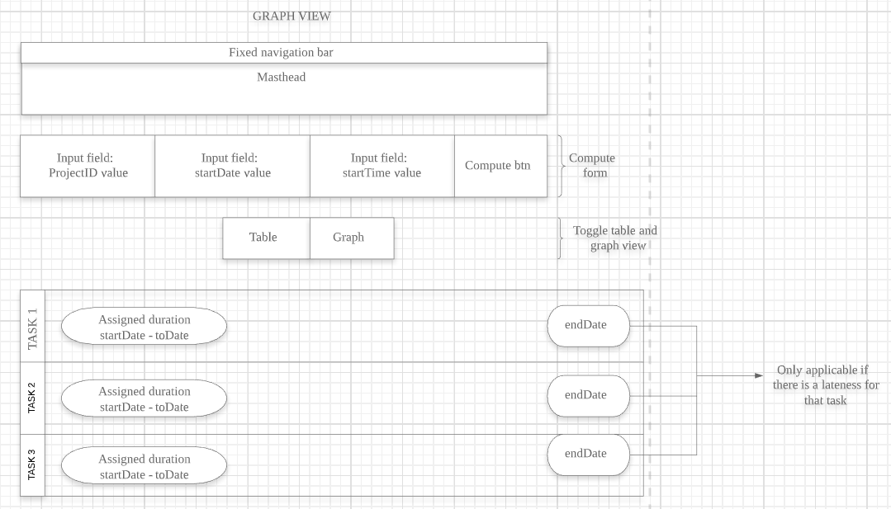

# Wireframe & Justification

## Wireframe

Starting view:

After computation / Upon toggling to table view:

Upon toggling to graph view:

## Justifications

### Justification 1

#### Good Points

1. Layout is clean and simple, allows for overlapping timelines
2. Able to view the status of each task: Complete, Incomplete, Slippage

#### Bad Points

1. Date ticks are too far apart and inconsistent
2. May be difficult to implement the stacked horizontal bars depending on library used 
3. No fields for input computation

### Justification 2

#### Good Points

1. Has a timeline and color-coded bars for better visualisation of the project tasks and deadlines
2. Timeline can also be adjusted to show daily, weekly, monthly, etc views
3. Able to show the members in the project 

#### Bad Points

1. No input computation fields
2. Dotted line showing current date on the timeline may be difficult to implement and automate correctly

### Justification 3

#### Good Points

1. Timeline is neat and consistent
2. Able to show multiple sub-tasks as well as the duration of the overarching task

#### Bad Points

1. Unable to determine the current status of each task
2. Timeline is only on a daily basis which is not suitable for projects that may take longer than a week or two
